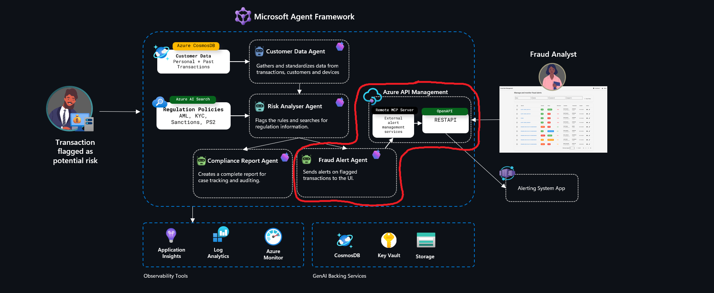

# Challenge 5: Azure Communication Services Voice Call Integration 📞

**Expected Duration:** 45 minutes

Welcome to Challenge 5! In this challenge, you'll integrate Azure Communication Services (ACS) voice calling capabilities into your fraud detection workflow. You'll enable the system to automatically call customers when high-risk transactions are detected, allowing real-time verification of potentially fraudulent activity.

This challenge demonstrates how to combine AI-powered fraud detection with real-time customer communication, creating a complete end-to-end solution that not only detects fraud but actively engages customers to verify suspicious transactions.

## What You'll Build

By the end of this challenge, you'll have enhanced your fraud detection system with:

- 📞 **Automated Voice Calls**: Outbound calling to customers when high-risk transactions are detected
- 🎙️ **Interactive Voice Response**: Text-to-speech messages and DTMF tone collection for customer verification
- 🔄 **Parallel Processing**: Voice calls execute alongside compliance reports and fraud alerts
- 📊 **Customer Data Enhancement**: Phone numbers added to customer profiles for contact

## Architecture Enhancement

This challenge extends the 4-executor architecture to a **5-executor architecture** with voice calling:

```
Customer Data → Risk Analyzer → ┌─ Compliance Report
                                 ├─ Fraud Alert
                                 └─ Voice Call (NEW!)
```

The Voice Call executor runs in parallel with the other executors, ensuring that customer notification happens immediately when fraud is suspected.


*Note: This builds upon the Challenge 2 architecture with an additional Voice Call executor*

## Prerequisites

Before starting this challenge, ensure you have:

1. ✅ Completed Challenge 2 (MCP Server Integration)
2. ✅ Access to Azure Communication Services resource
3. ✅ A phone number provisioned in ACS (optional for demo - will gracefully skip if not configured)
4. ✅ Understanding of the sequential workflow pattern from previous challenges

## Part 1: Understanding Azure Communication Services

Azure Communication Services (ACS) enables you to add voice, video, chat, and SMS capabilities to your applications. For fraud detection, we'll use:

### Key ACS Features

1. **Call Automation**: Programmatically create and manage phone calls
2. **Text-to-Speech**: Convert fraud alert messages to natural-sounding voice
3. **DTMF Recognition**: Collect customer input via phone keypad (1 = Authorized, 2 = Fraud, 9 = Speak to specialist)
4. **Event-Driven Architecture**: Handle call events asynchronously via webhooks

### Voice Call Flow

1. **Fraud Detected**: Risk Analyzer identifies high-risk transaction (risk score >= 75)
2. **Initiate Call**: Voice Call executor creates outbound call to customer
3. **Play Message**: TTS plays fraud alert with transaction details
4. **Collect Input**: System collects DTMF response from customer
5. **Process Response**: 
   - Press 1 → Transaction authorized (ALLOW)
   - Press 2 → Transaction fraudulent (BLOCK)
   - Press 9 → Escalate to specialist (INVESTIGATE)

## Part 2: Data Model Enhancement

### Add Phone Numbers to Customer Data

Phone numbers have been added to the customer data model in `challenge-0/data/customers.json`:

```json
{
  "customer_id": "CUST1001",
  "name": "Alice Johnson",
  "country": "US",
  "phone_number": "+15551234567",
  "account_age_days": 820,
  "device_trust_score": 0.9,
  "past_fraud": false
}
```

All customer records now include E.164 formatted phone numbers for their respective countries.

### Re-seed Customer Data (Optional)

If you want to update your Cosmos DB with phone numbers:

```bash
cd challenge-0
./seed_data.sh
```

This will add phone numbers to all existing customer records.

## Part 3: Configure Azure Communication Services

### Step 1: Set Up ACS Resource (If Not Already Created)

If you don't have an ACS resource:

1. **Create ACS Resource**:
   ```bash
   az communication create \
     --name <acs-resource-name> \
     --resource-group <your-rg> \
     --location global \
     --data-location UnitedStates
   ```

2. **Get Connection String**:
   ```bash
   az communication list-key \
     --name <acs-resource-name> \
     --resource-group <your-rg> \
     --query primaryConnectionString -o tsv
   ```

### Step 2: Provision Phone Number (Optional)

For full voice calling functionality, provision a phone number:

```bash
# List available phone numbers
az communication phonenumber list-available \
  --connection-string "<connection-string>" \
  --country-code US \
  --phone-number-type tollFree

# Purchase a phone number
az communication phonenumber purchase \
  --connection-string "<connection-string>" \
  --phone-number "+1234567890"
```

**Note**: Phone number provisioning may incur costs. For demo purposes, you can skip this step - the system will gracefully handle missing ACS configuration.

### Step 3: Update Environment Variables

Add the following to your `.env` file:

```bash
# Azure Communication Services (ACS) for Voice Calling
ACS_CONNECTION_STRING="endpoint=https://<acs-resource-name>.communication.azure.com/;accesskey=<access-key>"
ACS_PHONE_NUMBER="+1234567890"
ACS_COGNITIVE_SERVICES_ENDPOINT="https://<cognitive-services-name>.cognitiveservices.azure.com/"
```

**For Demo Without ACS**: You can leave these variables unset. The workflow will detect missing configuration and gracefully skip voice calls while still executing all other executors.

## Part 4: Understanding the Voice Call Module

The voice call functionality is implemented in `challenge-5/agents/acs_voice_call.py`:

### Key Components

1. **ACSVoiceCallClient**: Main client for ACS operations
   - `create_fraud_verification_call()`: Initiates outbound call
   - `play_message_and_collect_input()`: Plays TTS message and collects DTMF
   - `handle_dtmf_response()`: Processes customer input
   - `terminate_call()`: Ends active call

2. **Fraud Alert Message**: Customizable TTS script
   ```python
   Hello {customer_name}, this is an urgent security alert from your financial institution.
   
   We have detected a potentially fraudulent transaction on your account.
   
   Transaction Details:
   - Transaction ID: {transaction_id}
   - Amount: {amount} {currency}
   - Destination: {destination_country}
   
   If you authorized this transaction, please press 1.
   If you did NOT authorize this transaction, please press 2.
   To speak with a fraud specialist, please press 9.
   ```

3. **Response Handling**:
   - **1 (Authorized)**: `recommended_action = "ALLOW"`
   - **2 (Fraudulent)**: `recommended_action = "BLOCK"`
   - **9 (Escalate)**: `recommended_action = "INVESTIGATE"`

## Part 5: Enhanced Workflow Execution

### Run the Enhanced Workflow

The enhanced workflow is in `challenge-5/agents/sequential_workflow_with_voice.py`:

```bash
cd challenge-5/agents
python sequential_workflow_with_voice.py
```

### What Happens

1. **Customer Data Executor**: Retrieves transaction and customer data (including phone number)
2. **Risk Analyzer Executor**: Assesses fraud risk
3. **Parallel Execution** (if risk score >= 75):
   - **Compliance Report Executor**: Generates audit report
   - **Fraud Alert Executor**: Creates fraud alert via MCP
   - **Voice Call Executor** (NEW!): Initiates customer call

### Expected Output

```
🔄 Executing 5-Executor Fraud Detection Workflow with Voice Calling...

🎯 5-EXECUTOR PARALLEL WORKFLOW RESULTS WITH VOICE CALLING
============================================================

📋 COMPLIANCE REPORT EXECUTOR:
   Status: SUCCESS
   Transaction ID: TX1015
   Audit Report ID: AUDIT_20250102_143022
   Compliance Rating: NON_COMPLIANT
   Risk Score: 85.00
   Conclusion: HIGH RISK - Immediate review required...
   ⚠️  IMMEDIATE ACTION REQUIRED
   📋 REGULATORY FILING REQUIRED

🚨 FRAUD ALERT EXECUTOR:
   Status: SUCCESS
   Transaction ID: TX1015
   Alert ID: ALERT_TX1015_20250102_143025
   Alert Created: ✅ YES
   Severity: CRITICAL
   Decision Action: BLOCK
   Alert Status: OPEN
   Assigned To: fraud_monitoring_team
   Reasoning: High-risk transaction to Russia detected...

📞 VOICE CALL EXECUTOR (NEW):
   Status: SUCCESS
   Transaction ID: TX1015
   Call ID: aHR0cHM6Ly9jb252ZXJzYXRpb24=
   Call Initiated: ✅ YES
   Call Status: INITIATED
   Target Phone: +79161234567
   Customer Name: Igor Petrov
   Verification Status: AWAITING_RESPONSE
   Recommended Action: PENDING_VERIFICATION
   Customer Response: Call initiated - awaiting customer response

✅ 5-EXECUTOR PARALLEL WORKFLOW COMPLETED
   Architecture: Customer Data → Risk Analyzer → (Compliance Report + Fraud Alert + Voice Call)
```

### Graceful Degradation

If ACS is not configured:

```
📞 VOICE CALL EXECUTOR (NEW):
   Status: SUCCESS
   Transaction ID: TX1015
   Call ID: ACS_NOT_CONFIGURED
   Call Initiated: ❌ NO
   Call Status: SKIPPED
   Target Phone: +79161234567
   Customer Name: Igor Petrov
   Verification Status: ACS_NOT_AVAILABLE
   Recommended Action: INVESTIGATE
   ⚠️  Error: ACS not configured - voice calling disabled. Set ACS_CONNECTION_STRING and ACS_PHONE_NUMBER in .env to enable.
```

## Part 6: Testing Different Scenarios

### High-Risk Transaction (Voice Call Triggered)

```python
request = AnalysisRequest(
    message="Test high-risk transaction",
    transaction_id="TX1015"  # Russia - High risk
)
```

Expected: Voice call initiated because risk score >= 75

### Low-Risk Transaction (Voice Call Skipped)

```python
request = AnalysisRequest(
    message="Test low-risk transaction",
    transaction_id="TX1001"  # US - Low risk
)
```

Expected: Voice call skipped because risk score < 75

### Missing Phone Number

```python
# Edit customer data to remove phone_number or set to null
```

Expected: Graceful handling with error message "Customer phone number not available"

## Part 7: Handling Customer Responses (Advanced)

In a production implementation, you would set up webhook endpoints to handle customer DTMF responses:

### Webhook Flow

1. Customer presses phone key (1, 2, or 9)
2. ACS sends event to your webhook endpoint
3. Your handler processes the response:
   ```python
   dtmf_result = client.handle_dtmf_response(
       dtmf_input="2",  # Customer pressed 2 (fraud)
       transaction_id="TX1015"
   )
   # Result: {"verification_status": "FRAUDULENT", "recommended_action": "BLOCK"}
   ```
4. Update transaction status based on customer confirmation
5. Trigger appropriate actions (block transaction, alert fraud team, etc.)

### Example Webhook Handler (Conceptual)

```python
@app.post("/api/voice-callback")
async def handle_voice_callback(event: CloudEvent):
    if event.type == "Microsoft.Communication.RecognizeCompleted":
        dtmf_tones = event.data.get("tones")
        call_connection_id = event.data.get("callConnectionId")
        
        # Process customer response
        result = acs_client.handle_dtmf_response(
            dtmf_input=dtmf_tones,
            transaction_id=transaction_id
        )
        
        # Take action based on customer verification
        if result["recommended_action"] == "BLOCK":
            # Block transaction immediately
            block_transaction(transaction_id)
        
        # Terminate call
        acs_client.terminate_call(call_connection_id)
```

## Key Concepts

### Risk Score Threshold

The voice call executor only initiates calls for high-risk transactions:

```python
if risk_score < 75:
    # Skip voice call for low/medium risk
    return
```

This ensures customers are only contacted for genuinely suspicious activity, reducing false positives and unnecessary interruptions.

### Parallel Processing Benefits

Running voice calls in parallel with other executors:
- ✅ Minimizes total workflow execution time
- ✅ Enables immediate customer notification
- ✅ Doesn't block compliance reporting or alert creation
- ✅ Provides real-time fraud verification

### Error Handling

The voice call executor implements robust error handling:
- Missing ACS configuration → Gracefully skip with informative message
- Missing phone number → Log error and recommend investigation
- Call initiation failure → Capture error details for troubleshooting
- Transaction data errors → Handle gracefully without breaking workflow

## Integration with Existing Workflow

The voice call executor integrates seamlessly with your existing workflow:

```python
workflow = (
    WorkflowBuilder()
    .set_start_executor(customer_data_executor)
    .add_edge(customer_data_executor, risk_analyzer_executor)
    .add_edge(risk_analyzer_executor, compliance_report_executor)
    .add_edge(risk_analyzer_executor, fraud_alert_executor)
    .add_edge(risk_analyzer_executor, voice_call_executor)  # NEW!
    .build()
)
```

No changes required to existing executors - voice calling is additive!

## Production Considerations

### Webhook Endpoint Setup

For production deployment, you'll need:

1. **Public Webhook Endpoint**: 
   - Use Azure Functions or Container Apps
   - Implement HTTPS with valid certificates
   - Handle ACS event types (CallConnected, RecognizeCompleted, etc.)

2. **Event Processing**:
   - Store call state (call_id, transaction_id mapping)
   - Process DTMF responses asynchronously
   - Update transaction status in real-time
   - Trigger downstream actions based on customer response

3. **Monitoring & Logging**:
   - Track call success/failure rates
   - Monitor customer response patterns
   - Log all interactions for compliance
   - Set up alerts for call failures

### Cost Optimization

- **Call Volume**: Monitor call volumes and associated costs
- **TTS Usage**: Optimize message length to reduce TTS charges
- **Phone Number**: Consider toll-free vs. local numbers based on geography
- **Failed Calls**: Implement retry logic with exponential backoff

### Customer Experience

- **Call Timing**: Consider time zones and business hours
- **Message Clarity**: Use clear, concise language in TTS messages
- **Multiple Languages**: Support multiple languages for international customers
- **Fallback Options**: Provide SMS fallback if voice call fails

## Troubleshooting

### Common Issues

1. **"ACS_CONNECTION_STRING required"**
   - Add ACS connection string to `.env` file
   - Verify connection string format is correct

2. **"Customer phone number not available"**
   - Re-seed customer data to add phone numbers
   - Verify phone numbers are in E.164 format (+[country code][number])

3. **"Call initiation failed"**
   - Check ACS phone number is provisioned and active
   - Verify target phone number is valid
   - Ensure ACS resource has proper permissions

4. **Voice call skipped for high-risk transaction**
   - Check risk score calculation
   - Verify threshold (default: 75) matches your requirements
   - Review risk factors being evaluated

## Resources 📚

- **ACS Documentation**: [Azure Communication Services](https://learn.microsoft.com/en-us/azure/communication-services/)
- **Call Automation**: [Call Automation Concepts](https://learn.microsoft.com/en-us/azure/communication-services/concepts/call-automation/call-automation)
- **Voice Integration Samples**: [ACS Voice Samples](https://github.com/Azure-Samples/acs-azopenai-voice-integration)
- **Realtime Voice API**: [Voice Live API](https://techcommunity.microsoft.com/blog/azurecommunicationservicesblog/create-next-gen-voice-agents-with-azure-ais-voice-live-api-and-azure-communicati/4414735)

## Conclusion 🎉

Congratulations! You've successfully integrated Azure Communication Services voice calling into your fraud detection workflow, creating a comprehensive end-to-end solution that:

- 🤖 Detects fraudulent transactions using AI
- 📊 Generates compliance reports and audit trails
- 🚨 Creates real-time fraud alerts
- 📞 Contacts customers immediately for verification
- ⚡ Processes everything in parallel for maximum efficiency

Your fraud detection system is now truly enterprise-ready, combining the power of AI agents with real-time customer communication for the ultimate fraud prevention solution!

### What You Accomplished

| Component | Achievement | Technology Used |
|-----------|-------------|-----------------|
| **Voice Integration** | Automated customer calling for fraud verification | Azure Communication Services |
| **Customer Data** | Enhanced data model with contact information | Cosmos DB + Phone Numbers |
| **5-Executor Workflow** | Parallel processing with voice, alerts, and compliance | Microsoft Agent Framework |
| **Graceful Degradation** | System works with or without ACS configuration | Error Handling Best Practices |

### Next Steps

Consider extending this solution with:

- **Bi-directional Audio**: Real-time conversations with Azure OpenAI
- **Multi-language Support**: TTS in customer's native language
- **SMS Fallback**: Send SMS if voice call fails
- **Call Recording**: Record calls for compliance and training
- **Analytics Dashboard**: Track call success rates and customer responses
- **A/B Testing**: Test different fraud alert messages for effectiveness
